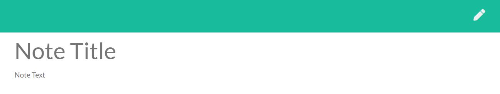
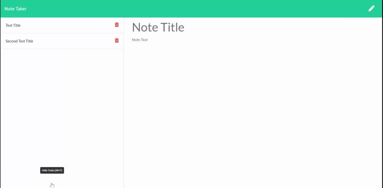
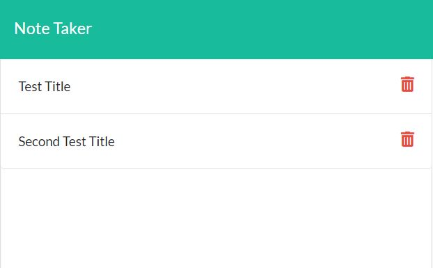
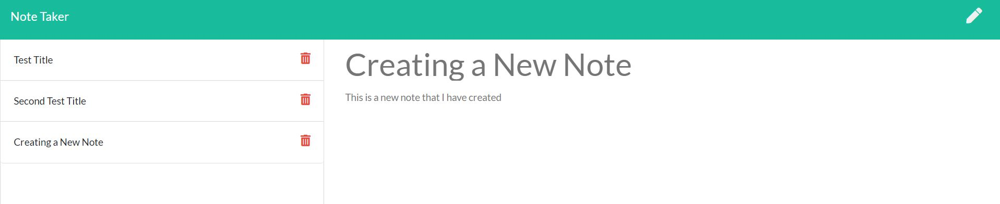

  # Notebook
  
  
  ## Table of Contents
  * [Description](#description)
  * [Installation](#installation)
  * [Usage](#usage)
  * [License](#license)
  * [Contribute](#contribute)
  * [Testing](#testing)
  * [Questions](#questions)
    
  ## Description
  
  
 An online notebook that saves, deletes, and presents notes that the user writes. 

  
  ## Installation
  
 Nothing needs to be installed, it works completely on Heroku 

  ## Usage
  
  
 The user may write notes by pressing the pen icon in the upper right hand corner or when first opening the page. 

  
    
  
  
  
 Once a note is written, a save icon appears and allows the user to save their note to the database. Saved notes are stored and presented on the left hand column of the screen.
 
  
  
    
  
  
  
Clicking on them will allow the user to view the specified note. If the user wishes to delete a note, they click on the trash icon on the note and the note will be deleted from the database and the page will reload with the updated database.  

  ## License
  
 This app is covered under the MIT License 

  
  ## Contribute
  
 Contact Conor using the info provided below 

  ## Questions
  
 For any questions, contact me at 

  <h3> Email : </h3>
  <strong>mckoyc@gmail.com</strong>
    
  <h3> Github Account:</h3>
  
  
  [mckoyc94](https://github.com/mckoyc94)

